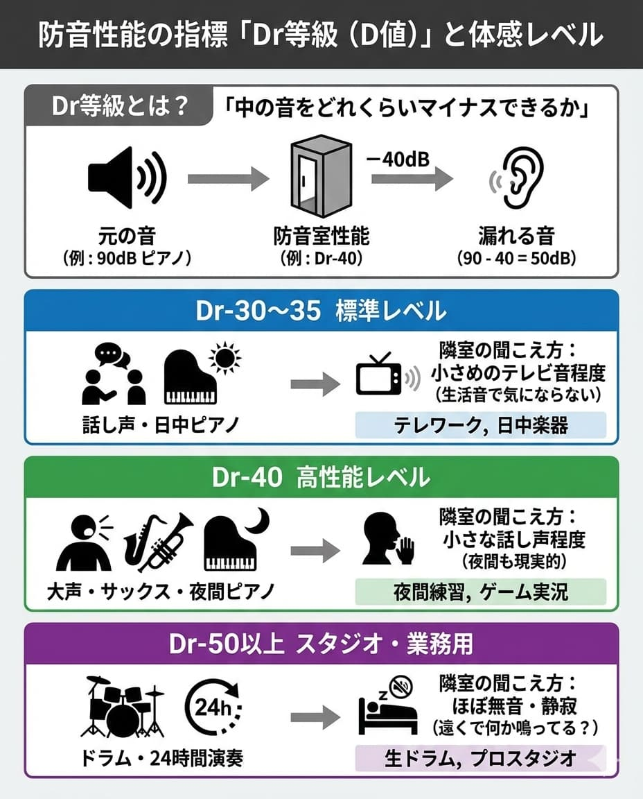

---
title: "防音室の効果はどれくらい？楽器・話し声の減衰レベル"
description: "「D-30」「D-40」って結局どれくらい静かになるの？防音室の性能を示す指標「Dr等級」を、実際の聞こえ方（体感レベル）で分かりやすく解説。ピアノ、ドラム、話し声など、用途別に必要な性能レベルも紹介します。"
slug: "soundproof-room-effectiveness"
date: "2026-01-05T00:00:00+09:00"
lastmod: "2026-02-28"
draft: false
lang: "ja"
category: "solutions"
subcategory: "unit-rooms"
tags: ["防音室の効果","遮音性能","Dr等級","D値","音漏れ"]
image: ./cover.jpg
---
<RegionBanner />

「高いお金を出して防音室を買ったのに、隣から苦情が来たらどうしよう…」

最も不安なのは、やはり「<strong>実際の効果</strong>」ですよね。
カタログに書いてある「Dr-35」や「Dr-40」という数字を見ても、具体的にどれくらい音が消えるのかイメージしづらいのが本音でしょう。

この記事では、防音室の効果（遮音性能）を、数値ではなく「<strong>体感レベル</strong>」で分かりやすく解説します。

## 防音性能の指標「Dr等級（D値）」とは？

防音室の性能は、JIS規格の「Dr等級（ディーアールとうきゅう）」で表されます。
簡単に言うと、「<strong>中の音をどれくらい減らせるか（マイナスできるか）</strong>」という数値です。

*   <strong>Dr-30</strong>: 音を「-30dB（デシベル）」する
*   <strong>Dr-40</strong>: 音を「-40dB（デシベル）」する

元の音が「90dB（ピアノなど）」で、防音室が「Dr-40」なら、
外に漏れる音は <strong>90dB - 40dB = 50dB</strong> になります。

## 【体感レベル】Dr等級別の聞こえ方

では、減衰後の音が「実際にどう聞こえるか」をイメージしてみましょう。
※壁1枚隔てた隣の部屋での聞こえ方です。

### Dr-30 〜 Dr-35（標準レベル）
*   <strong>効果</strong>: <strong>「人の話し声（普通の大きさ）」がほぼ聞こえなくなるレベル。</strong>
*   <strong>楽器の場合</strong>: ピアノの音は「テレビを小さめの音量で見ている」くらいに聞こえます。歌詞は聞き取れませんが、曲調は分かります。
*   <strong>向いている用途</strong>:
    *   テレワーク、ウェブ会議
    *   日中のピアノ練習
    *   アコースティックギターの弾き語り
    *   フルートなどの管楽器（日中）

### Dr-40（高性能レベル）
*   <strong>効果</strong>: <strong>「大声や怒鳴り声」でも、隣ではかすかに聞こえる程度。</strong>
*   <strong>楽器の場合</strong>: ピアノの音は「小さな話し声」程度まで下がります。テレビや生活音があれば、気にならないレベルです。夜間の練習も現実的になります。
*   <strong>向いている用途</strong>:
    *   夜間のピアノ練習
    *   サックス、トランペット（金管楽器）
    *   本格的なボイスレコーディング
    *   ゲーム実況（絶叫系）

### Dr-50以上（スタジオ・業務用レベル）
*   <strong>効果</strong>: <strong>「外の世界と遮断された」静寂。</strong>
*   <strong>楽器の場合</strong>: ドラムセットを叩いても、隣の部屋では「遠くで何か鳴っているかな？」程度。ほぼ無音に近いです。
*   <strong>向いている用途</strong>:
    *   生ドラムの演奏
    *   24時間いつでも演奏したい
    *   プロ仕様のスタジオ構築

> <strong>注意</strong>: ユニット型防音室（組立式）の限界は、一般的に「Dr-40」程度です。Dr-50以上を目指すなら、専門業者による「防音工事」が必要になります。

## 用途別：あなたに必要な性能は？

失敗しない選び方は、<strong>「一番大きな音（ピーク音量）」に合わせて性能を選ぶ</strong>ことです。

1.  <strong>歌ってみた・ゲーム実況・テレワーク</strong>
    *   <strong>推奨: Dr-30 〜 Dr-35</strong>
    *   人の声なら、標準的な防音室で十分カバーできます。ただし「絶叫」するスタイルならDr-40が安心です。

2.  <strong>アップライトピアノ・アコギ・弦楽器</strong>
    *   <strong>推奨: Dr-35 〜 Dr-40</strong>
    *   ピアノは音が大きく、床への振動もあるため、Dr-35以上は必須。夜間も弾くなら迷わずDr-40を選びましょう。

3.  <strong>サックス・トランペット・金管楽器</strong>
    *   <strong>推奨: Dr-40</strong>
    *   音が鋭く貫通力があるため、高い遮音性能が必要です。Dr-30では不満が出る可能性が高いです。

4.  <strong>生ドラム・低音楽器</strong>
    *   <strong>推奨: Dr-50以上（+防振工事）</strong>
    *   空気の音だけでなく「振動」が凄まじいため、ユニット防音室だけでは対策できません。高額なリフォーム工事が前提となります。

## まとめ：隣人の生活音レベルまで下げればOK

防音のゴールは「音をゼロにすること」ではありません。
「<strong>隣の家の生活音（エアコン、テレビ、冷蔵庫など）よりも小さくすること</strong>」です。

環境音に紛れてしまえば、人は音を「騒音」として認識しにくくなります。
自分の用途に合ったDr等級を選び、快適な防音ライフを手に入れましょう。

[→ 関連：防音室の仕組み｜なぜ音を消せるのか？](soundproof-room-mechanism)
[→ 防音室の基礎知識マップ（トップ）へ戻る](bouonroom-tettei-kaisetsu)

