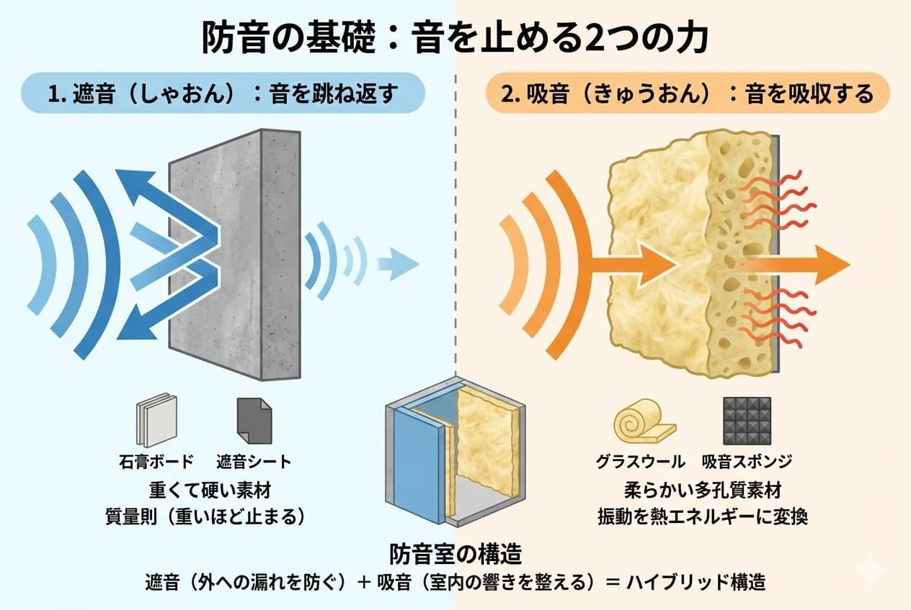

<RegionBanner />

「なぜ防音室に入ると音が消えるの？」
「重たい壁なら防音できるんじゃないの？」

防音室の購入を検討し始めると、「<strong>遮音（しゃおん）</strong>」や「<strong>吸音（きゅうおん）</strong>」といった専門用語が出てきて混乱してしまうことがあります。

結論からお伝えすると、防音室の静寂を守っているのは<strong>「重さ（質量）」と「空気の層」のコンビネーション</strong>です。

この記事では、防音室が音を止めるメカニズムと、失敗しないために知っておきたい「防音の3大要素」について、専門用語を噛み砕いて解説します。

## 防音の基礎：音を止める2つの力

防音室の壁は、単なる分厚い板ではありません。音を止めるためには、役割の異なる2つの力が必要です。

### 1. 遮音（しゃおん）：音を跳ね返す

「<strong>遮音</strong>」とは、音が壁を通り抜けるのを防ぐことです。
具体的には、石膏ボードや遮熱シートなどの<strong>重くて硬い素材</strong>で音を跳ね返します。

- <strong>イメージ:</strong> コンクリートの壁にボール（音）を投げると、向こう側に抜けずに跳ね返ってくる状態。
- <strong>重要な法則（質量則）:</strong> 壁が重ければ重いほど、音は止まります。

### 2. 吸音（きゅうおん）：音を吸収する

「<strong>吸音</strong>」とは、音のエネルギーを熱エネルギーに変えて減衰させることです。
グラスウール（綿のような素材）やスポンジなどの<strong>柔らかくて気泡のある素材</strong>が、音の振動を絡め取ります。

- <strong>イメージ:</strong> クッションに向かってボール（音）を投げると、勢いが吸収されてポトリと落ちる状態。
- <strong>役割:</strong> 遮音だけだと部屋の中で音がワンワン響いてしまうため、吸音材で響きを整えます。

> <strong>Point</strong>: 防音室は、「遮音材」で外への音漏れを防ぎ、「吸音材」で室内の響きをクリアにする、ハイブリッドな構造になっています。

## 防音室の「最強」構造：BOX in BOXとは

高い性能を持つ防音室（ヤマハのアビテックスなど）は、「<strong>BOX in BOX（箱の中の箱）</strong>」と呼ばれる構造を採用しています。また、そのカギとなるのが「<strong>浮構造（うきこうぞう）</strong>」です。

### 空気の層が振動を断ち切ります

音は「空気」だけでなく、「床や壁（振動）」を伝って隣の部屋に漏れていきます（固体伝播音）。
これを防ぐため、防音室は建物の壁や床から<strong>物理的に切り離された状態</strong>で作られます。

1.  <strong>浮き床</strong>: 防音室の床は、防振ゴムなどの上に乗っており、建物の床と直接触れていません。
2.  <strong>空気層</strong>: 建物の壁と防音室の壁の間には、必ず数センチの隙間（空気層）があります。

この「浮いている状態」のおかげで、ドラムや足音のような「ドンドン」という振動音が、隣の部屋に伝わるのを劇的に防ぐことができるのです。

## 気密性：隙間は防音の最大の敵

どんなに分厚い壁を作っても、<strong>わずか数ミリの隙間</strong>があれば、音はそこから盛大に漏れ出します。これを「隙間漏れ」と言います。

- <strong>コンセント:</strong> 壁に穴を開けるため、最大の弱点になりやすい箇所です。
- <strong>換気扇:</strong> 空気を通しつつ音を止める「防音換気扇（ロスナイなど）」が必須です。
- <strong>ドアのパッキン:</strong> 防音ドアは、冷蔵庫のようにゴムパッキンで密閉し、空気を遮断します。

自作（DIY）の防音室が失敗しやすい最大の原因は、この「気密性」の確保が難しいためです。メーカー製の防音室は、工場精度で密閉するため、安定した性能を発揮します。

---

## 2026年：薄さと軽さを両立する「音響メタマテリアル」

これまでの防音室は「重たい壁」が必須でしたが、2026年現在、新しい技術として <strong>音響メタマテリアル（Acoustic Metamaterials）</strong> が実用化され始めています。

これは、素材の「質量」ではなく、特殊な「形状」によって音の波を相殺する技術です。これにより、従来の半分以下の厚みや重さであっても、同等の遮音性能を発揮できるようになりつつあります。将来的には、より軽くて設置しやすい防音室が当たり前になっていくでしょう。

---

## まとめ：良い防音室の条件

防音室の仕組みを整理すると、以下の3点が揃っていることが性能の証です。

1.  <strong>重さがある（遮音）</strong>: しっかりとした重量のある壁材を使っている。
2.  <strong>隙間がない（気密）</strong>: 防音ドアや専用換気扇で密閉されている。
3.  <strong>浮いている（防振）</strong>: 建物の床や壁から振動的に絶縁されている。

仕組みを理解すると、「なぜ防音室は重いのか」「なぜ価格が高いのか」が見えてきます。
次は、これらの構造の違いによる「防音室の種類」について見ていきましょう。

[→ 関連：防音室の種類と選び方｜ユニット・組立・工事の違い](soundproof-room-types)
[→ 防音室の基礎知識マップ（トップ）へ戻る](bouonroom-tettei-kaisetsu)

