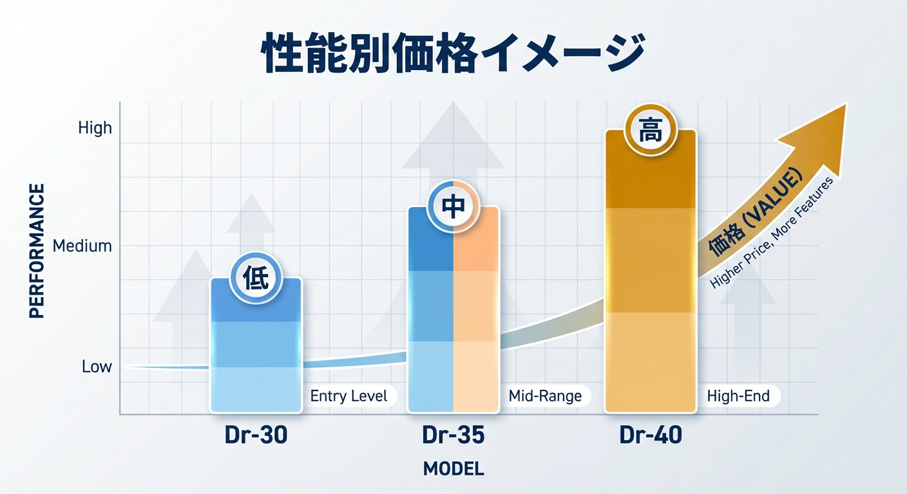

<RegionBanner />

「防音室が欲しいけど、そもそもいくらするの？」

ネットで調べても、価格は <strong>「お問い合わせください」</strong> ばかりで、予算が立てられずに困っていませんか？

この記事では、Kind Life Advisorとして、防音室の <strong>リアルな価格相場</strong> をサイズ・性能別に公開します。

## 防音室の価格相場：サイズ別一覧

まず、最も人気のあるユニット型防音室の価格を見てみましょう。

| サイズ                 | 用途例                               | 価格相場（新品） |
| :--------------------- | :----------------------------------- | :--------------- |
| <strong>0.5畳</strong> | ナレーション録音、弾き語り           | 30万〜50万円     |
| <strong>0.8畳</strong> | ピアノ、電子ドラム                   | 50万〜70万円     |
| <strong>1.2畳</strong> | ギター＋ボーカル、配信               | 60万〜90万円     |
| <strong>1.5畳</strong> | アップライトピアノ、VTuber配信       | 80万〜120万円    |
| <strong>2.0畳</strong> | グランドピアノ、バンド練習（1〜2名） | 120万〜180万円   |

※メーカー：ヤマハ（アビテックス）、カワイ（ナサール）の場合

## 性能（Dr値）による価格差

防音室の性能は <strong>「Dr値（デシベル）」</strong> で表されます。
数値が高いほど、遮音性能が高い（＝音が漏れにくい）です。

| Dr値                   | 性能イメージ（具体例）                                                | 価格の目安（1.5畳） |
| :--------------------- | :-------------------------------------------------------------------- | :------------------ |
| <strong>Dr-30</strong> | ピアノ：半減／会話：ほぼ消える／<strong>配信：叫ぶと丸聞こえ</strong> | 60万〜80万円        |
| <strong>Dr-35</strong> | ピアノ：微か／<strong>配信：絶叫しても「会話」レベルに低減</strong>   | 80万〜100万円       |
| <strong>Dr-40</strong> | <strong>ピアノ・絶叫：ほぼ消える／ドラム：爆音のまま</strong>         | 100万〜150万円      |

<SmartLink href="/ja/solutions/sound-reduction-simulation/">
  → 関連記事：防音室で音はどこまで消える？用途別の軽減率シミュレーション
</SmartLink>

<strong>重要</strong> :
Dr値が5上がるごとに価格は約20万円アップしますが、用途を誤ると「100万円払って苦情が来る」という最悪のミスマッチが起きます。詳細は上記のシミュレーション記事で必ず確認してください。

## 資産価値としての防音室：経済合理性（ROI）の分析

防音室の購入を「単なる出費」ではなく「資産形成」として捉える視点が重要です。

### 中古市場におけるリセールバリュー

ヤマハ（アビテックス）やカワイ（ナサール）のユニット型防音室は、中古市場での流動性が非常に高く、<strong>購入から5〜10年経過しても定価の40%〜60%で取引</strong>されるケースが少なくありません。

| 項目                               | ユニット型（ヤマハ等）                    | 造作防音工事             |
| :--------------------------------- | :---------------------------------------- | :----------------------- |
| <strong>初期費用</strong>          | 80万〜150万円                             | 250万〜500万円           |
| <strong>移設・売却</strong>        | <strong>可能（資産価値維持）</strong>     | 不可（解体費用が発生）   |
| <strong>ROI（投資回収率）</strong> | <strong>高い（売却益が見込める）</strong> | 低い（居住時のみの価値） |

### 賃貸併用・収益化のシミュレーション

防音室を導入した部屋を「防音室付き物件」として貸し出す場合、周辺相場より <strong>+20%〜30%の賃料プレミアム</strong> を上乗せできる事例が増えています。

## 技術スペックの深化：Dr値と透過損失（TL）

「なんとなく静か」ではなく、物理学的なスペックで性能を評価しましょう。

- <strong>Dr値（遮音等級） :</strong> 空間全体の遮音性能を示す指標。
- <strong>透過損失（TL: Transmission Loss） :</strong>
  壁材そのものが音を遮る能力（dB）。
- <strong>面密度（kg/m²） :</strong> 壁1平米あたりの重量。遮音性能は
  <strong>「質量則」</strong>
  に従い、面密度が2倍になれば遮音性能は約6dB向上します。

高品質な防音室は、Dr-40（D-40相当）を維持するために、1畳あたり <strong>400kg〜600kg</strong> もの重量（面密度）を持たせています。安価な簡易防音室が「軽い」のは、物理的に遮音性能に限界があることの裏返しです。

## メーカー別の価格帯

### ヤマハ「アビテックス」（シェアNo.1）

- <strong>特徴 :</strong> 高品質、メンテナンス体制が充実
- <strong>価格 :</strong> やや高め（1.5畳で90万〜120万円）
- <strong>おすすめ :</strong> 長期利用、本格派

### カワイ「ナサール」

- <strong>特徴 :</strong> ヤマハより2〜3割安い
- <strong>価格 :</strong> コスパ重視（1.5畳で70万〜100万円）
- <strong>おすすめ :</strong> 予算を抑えたい人

### VERYQ「だんぼっち」

- <strong>特徴 :</strong> 超コンパクト、DIY組立
- <strong>価格 :</strong> 激安（1畳未満で10万〜15万円）
- <strong>注意 :</strong> 遮音性能は低い（Dr-25程度）

## 隠れたコスト：設置費用と搬入費

防音室本体の価格だけではありません。以下の <strong>追加費用</strong> も必ず発生します。

| 項目                          | 費用相場                 |
| :---------------------------- | :----------------------- |
| <strong>搬入・組立費</strong> | 5万〜10万円              |
| <strong>エアコン設置</strong> | 10万〜20万円（専用機種） |
| <strong>防振マット</strong>   | 1万〜3万円               |
| <strong>照明追加</strong>     | 1万〜5万円               |

<strong>重要</strong> : 見積もり時に <strong>「総額（オールインワン）」</strong>
を必ず確認しましょう。

## 予算別：あなたに合った防音室選び

### 予算30万円以下

- <strong>選択肢 :</strong> だんぼっち、中古の0.5畳
- <strong>用途 :</strong> 配信、ナレーション録音

### 予算50万〜80万円

- <strong>選択肢 :</strong> ヤマハ0.8畳（Dr-30）、カワイ1.2畳
- <strong>用途 :</strong> 電子ドラム、ギター、ピアノ（アップライト）

### 予算100万円以上

- <strong>選択肢 :</strong> ヤマハ1.5畳以上（Dr-35〜40）
- <strong>用途 :</strong> 本格的な楽器練習、レコーディング

## まとめ：まずはショールームで体感を

防音室は <strong>「数字（Dr値）」</strong> だけでは判断できません。
実際に中に入って、音の響き、圧迫感、使い勝手を確認することが最も重要です。

ヤマハ・カワイともに全国にショールームがあるので、まずは予約して訪問してみましょう。

