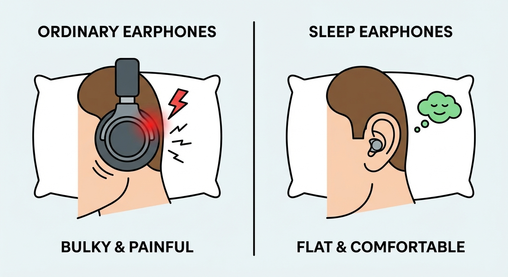

"I can't concentrate on studying because of the neighbors talking."
"Footsteps upstairs keep me awake at night."

You can't move. You can't renovate.
But there is one solution you can try right now:
<strong>"Give up on soundproofing the room, and silence the sound at your ears."</strong>

With the incredible evolution of <strong>Active Noise Canceling (ANC)</strong> technology, you can drastically reduce noise stress if you use it correctly.
Today, we introduce the <strong>"Earplugs + Headphones Ultimate Combo"</strong> and secret gadgets dedicated to sleep.

## Why Earplugs Alone Aren't Enough

"I'm wearing earplugs, but I can still hear the thumping footsteps."
This isn't because your earplugs are bad. It's because of <strong>Low Frequency (Vibration) Noise</strong>.

- <strong>Earplugs :</strong> Great at blocking high-pitched sounds (voices, metallic clanks) but low sounds vibrate through your body.
- <strong>Noise Canceling :</strong> Conversely, excellent at erasing "low, continuous droning sounds" (humming, rumbling).

Using just one is incomplete.
This is where the <strong>"Digital + Analog Hybrid"</strong> strategy comes in.

## The Strongest Defense: Earplugs + NC Headphones

The method is simple, but the effect is profound.

1.  Insert high-performance foam earplugs (like MOLDEX). This cuts the "High Frequencies" of daily life.
2.  Put on top-tier Noise Canceling Headphones and turn ANC ON. This cancels out the "Low Frequencies" that earplugs miss.

When you do this, you enter a <strong>"Room of Spirit and Time"</strong>—almost total silence.
Even AC noise or distant traffic vanishes, letting you immerse yourself completely in your work.

### Recommended NC Headphones (2025 Edition)

Here are the 3 best choices to invest in for overwhelming silence.
Honestly, if you have the budget, <strong>Sony</strong> or <strong>Bose</strong> are the best. However, both cost <strong>over $350</strong>.

"I can't spend that much, but I want silence."
For you, I have a <strong>"Realistic Optimal Solution"</strong> that I highly recommend.

#### 1. Sony WH-1000XM5 (For those with ample budget)

<strong>The Absolute King of Silence</strong>
World-class NC performance. Its reaction speed to "human voices" and "sudden sounds" is unmatched. If you want the absolute best performance, choose this.

#### 2. Bose QuietComfort Ultra Headphones (For glasses wearers)

<strong>God of Comfort</strong>
As the name suggests, the comfort is divine. It has powerful NC rivaling Sony, but with soft side pressure that doesn't hurt your head. Highly recommended if you wear glasses for long work sessions.

#### 3. Anker Soundcore Space Q45 (The Smart Choice)

<strong>The Best Value Savior</strong>

"I can't spend $350, but I want silence." This is your savior.
Despite being int the <strong>$100 range</strong>, it possesses NC performance comparable to older high-end models.

I use this daily, and its ability to cancel "low-frequency noise" like ventilation fans and distant construction is incredibly close to the top-tier models. When combined with earplugs, the difference becomes almost indistinguishable.
<strong>If this is your first NC experience, this will be more than enough to impress you.</strong>

Get "Silence" cheaply, and use the saved money to treat yourself to a nice meal.

👉 <strong>[Check Price & Stock for Anker Soundcore Space Q45](https://amzn.to/4kpCLxa)</strong>

## For Sleeping: "Sleep Buds" (Sleep Headphones)

"I can't sleep with bulky headphones on!"
Exactly. The combo above is for "Focus & Work."

For sleeping, we recommend "Sleep Buds" like the <strong>Anker Soundcore Sleep A20</strong>.

### Not for Music

These are different from regular earbuds.
They play soothing <strong>Ambient Sounds (White Noise)</strong> like rain or campfire to <strong>"Mask"</strong> the surrounding noise.

"Isn't playing sound just adding noise?" hardly.
The brain ignores constant ambient sound, allowing you to sleep much deeper than if you were woken up by sudden spikes in noise (like a door slamming).
They fit snugly inside your ear, so they don't hurt even if you sleep on your side.

---

## Summary: Invest in Protecting Your Ears

Complaining to noisy neighbors often leads to more trouble (and stress).
First, invest in <strong>"Physically blocking sound to protect your mind."</strong>

1.  <strong>Work/Study</strong> : Earplugs + Sony/Bose Headphones
2.  <strong>Sleep</strong> : Sleep Earbuds

Spending non-trivial money might hurt, but buying "Peaceful Sleep" and "Stress-free Time" every day is a cheap price to pay.

Try renting them or visiting an electronics store to experience the "Silence" yourself. It will change your world.

## Related Articles

- <strong>[Living Noise] : [Soundproofing Wooden Apartments: 3 Realistic Steps to Zero Complaints](wooden-apartment-soundproof-guide)</strong>
- <strong>[Noise Complaints] : [Dealing with Noise Complaints: Case Studies and Legal Precedents](noise-complaint-solution)</strong>

