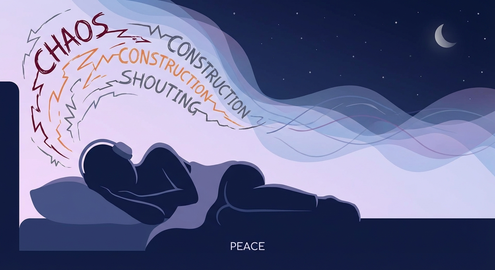
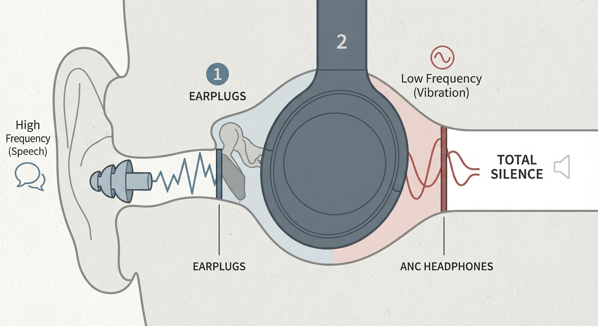

<RegionBanner />

「隣の部屋の話し声が気になって勉強に集中できない」
「深夜の足音で目が冴えてしまい、寝不足が続いている」

引っ越しもできない、防音工事もできない。
そんな八方塞がりの状況でも、一つだけすぐにできる解決策があります。
それは、 <strong>「部屋の防音を諦めて、耳元で音を消す」</strong> ことです。

近年の「アクティブノイズキャンセリング（ANC）」技術の進化は凄まじく、これを正しく使えば、騒音ストレスを劇的に減らすことができます。
今回は、最強の組み合わせと言われる <strong>「耳栓＋ヘッドホン」</strong> の技と、睡眠専用の秘密道具を紹介します。

## なぜ「耳栓」だけでは音が消えないのか

「耳栓をしているのに、ドスドスという足音が聞こえる」
これは耳栓の性能不足ではありません。 <strong>低音（振動音）</strong> のせいです。

- <strong>耳栓 :</strong> 高い音（話し声、金属音）を遮断するのは得意だが、低い音は体を伝わって聞こえてしまう。
- <strong>ノイズキャンセリング :</strong> 逆に「低い音（ゴーッという持続音）」を消すのが得意。

つまり、どちらか片方だけでは不完全なのです。
ここで登場するのが、両方を同時に使う <strong>「デジタルとアナログのハイブリッド」</strong> 戦法です。

## 最強の自衛策：耳栓 ＋ ノイキャンヘッドホン

やり方は単純ですが、効果は絶大です。

1.  まず、高性能なフォームタイプ耳栓（MOLDEXなど）を装着します。これで生活音の「高音域」をカットします。
2.  その上から、最高クラスのノイズキャンセリングヘッドホンを装着し、ANCをONにします。これで耳栓が防ぎきれない低音域を打ち消します。

この状態になると、まるで <strong>「精神と時の部屋」</strong> に入ったかのような静寂が訪れます。
エアコンの音や遠くの車の音すら消え、目の前の作業に没頭できるようになります。

### おすすめのノイキャンヘッドホン（2025年版）

圧倒的な静寂を手に入れるための「投資すべき」3選です。
正直に言うと、予算があるなら <strong>Sony</strong> や <strong>Bose</strong> が最高です。しかし、どちらも <strong>5万円以上</strong> もします。

「そこまでは出せないけど、静寂は手に入れたい」
そんなあなたに、 <strong>私が最も推したい「現実的な最適解」</strong> があります。

#### 1. Sony WH-1000XM5（予算が潤沢な人向け）

<strong>静寂界の絶対王者</strong>
ノイキャン性能は世界最高峰。特に「人の声」や「突発的な音」への反応速度が凄まじいです。「とにかく最強の性能が欲しい」という人にはこれ一択です。

#### 2. Bose QuietComfort Ultra Headphones（メガネの人向け）

<strong>装着感の神様</strong>
Sonyに匹敵する強力なノイキャンを持ちながら、側圧がソフトで頭が痛くなりにくいのが特徴。メガネを掛けて長時間作業するならこちらです。

#### 3. Anker Soundcore Space Q45（賢い選択）

<strong>コスパ最強の救世主</strong>

「5万円は出せないけど、静寂は欲しい」という人への救世主です。
<strong>1万円台</strong> という価格ながら、ひと昔前の3万円台レベルのノイキャン性能を持っています。

実際に毎日使っていますが、換気扇の音や遠くの工事音などの「低音ノイズ」を消す能力は、上位機種に肉薄しています。耳栓と組み合わせれば、その差はほとんど分からなくなります。
<strong>初めてのノイキャン体験なら、まずはこれで十分すぎるほど感動できます。</strong>

「静寂」を安く手に入れて、浮いた3万円で美味しいものでも食べてください。

👉 <strong>[Anker Soundcore Space Q45 の在庫・価格をチェックする](https://amzn.to/4kpCLxa)</strong>

## 睡眠時には「睡眠専用イヤホン（寝ホン）」を

「ヘッドホンをしたままでは、寝返りが打てなくて眠れない！」
その通りです。上記の最強セットは、あくまで「集中・作業用」です。

睡眠時の騒音対策には、 <strong>Anker Soundcore Sleep A20</strong> のような「スリープバッズ」をおすすめします。

### 音楽を聴くためではないイヤホン

これは普通のイヤホンとは違います。
「雨の音」や「焚き火の音」など、心地よい <strong>環境音（ホワイトノイズ）</strong> を流し続けることで、周囲の不快な騒音を「上書き（マスキング）」するのです。

「音で音を消すなんて、うるさくないの？」と思うかもしれませんが、人間の脳は「一定の環境音」を無視できるため、突発的な騒音（ドアの開閉音など）で起こされるよりも遥かに深く眠れます。
形状も耳の中にすっぽり収まるため、装着したまま横向きで寝ても耳が痛くなりません。

---

## まとめ：自分の耳を守ることに投資しよう

騒音トラブルは、解決しようとして相手に苦情を言うと、さらなるトラブル（逆恨みなど）に発展するリスクがあります。
まずは「<strong>物理的に音を遮断して、自分の心を守る</strong>」ことに投資してみてください。

1.  <strong>作業・勉強</strong> : 耳栓 ＋ Sony/Bose のヘッドホン
2.  <strong>睡眠</strong> : 睡眠専用イヤホン（寝ホン）

4〜5万円の出費は痛いかもしれませんが、それで「毎日の平穏な睡眠」と「ストレスのない時間」が買えるなら、決して高い買い物ではないはずです。

まずは家電量販店やレンタルサービスで、その「静寂」を体験してみてください。世界が変わります。

