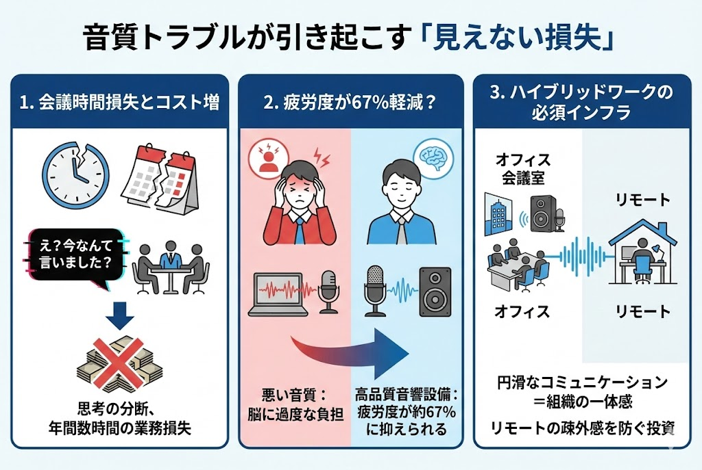

<RegionBanner />

「今の発言、もう一度お願いします」
「音声が途切れてよく聞こえません」

Web会議で頻発するこのやりとり、実は<strong>重大な経営コスト</strong>になっていることをご存知でしょうか？

1時間の会議で10分の音声トラブルがあれば、参加者全員の時間の16%が無益な待機時間に変わります。人数が多ければ多いほど、その損失額は膨れ上がります。

この記事では、総務・ファシリティ担当者様に向けて、Web会議の生産性を劇的に向上させる音響設備の選び方と、定量的な導入メリットを解説します。

## 【問題提起】音質トラブルが引き起こす「見えない損失」

### 「え？今なんて言いました？」が奪う会議時間
通信環境やマイクの品質によるトラブルは、単に会話を中断させるだけではありません。重要な意思決定の場において、参加者の思考を分断し、会議の密度を著しく低下させます。

アメリカの調査では、オンライン会議における音声トラブルが原因で、1人あたり年間数時間の業務時間が失われているというデータもあります。

### 疲労度が67%に軽減？快適な音響環境の数値的根拠
音質の悪い会議は、脳に過度な負担をかけます。ノイズ混じりの音声を脳内で補完しながら聞き取る作業は、無意識のうちに参加者を疲弊させます。

適切な音響設備（高品質マイクやスピーカー）を導入した場合、そうでない環境と比較して<strong>会議後の疲労度が約67%に抑えられる</strong>という報告もあります。「聞き取りやすさ」は、従業員の健康を守り、集中力を維持するための投資なのです。

### ハイブリッドワーク時代の必須インフラとしての音響
出社と在宅が混在するハイブリッドワークが定着した今、オフィス側の音響設備は「あれば便利なもの」から「必須インフラ」へと変化しました。
オフィスの会議室から参加するメンバーの声が不明瞭だと、リモート参加者は疎外感を感じ、議論への参加意欲が低下します。円滑なコミュニケーションを担保することは、組織の一体感を保つ上でも不可欠です。

## 生産性を下げる「3つの音響課題」とその対策

会議室で起きがちな3大トラブルと、それを技術的に解決する機能を紹介します。

### ① エコー・ハウリング：言葉の重複を避ける「エコーキャンセラー」
自分の声がスピーカーから戻ってきて反響する現象（エコー）や、「キーン」という不快音（ハウリング）。これは、スピーカーから出た音をマイクが拾ってしまうことで発生します。

<strong>対策</strong>：<strong>エコーキャンセリング機能</strong>を搭載したマイクスピーカーを使用することで、スピーカーから出た音だけをデジタル処理で消去し、クリアな会話を実現します。

### ② 周囲の雑音：タイピング音を消す「ノイズサプレッション」
空調の動作音、ホワイトボードを書く音、キーボードの打鍵音など、マイクは人間の声以外の音も拾います。

<strong>対策</strong>：<strong>ノイズサプレッション（雑音抑制）機能</strong>は、定常的なノイズを検知してカットする技術です。最近ではAIが人の声とそれ以外を識別し、クリアに抽出する製品も増えています。

### ③ 声の大小：マイクの集音範囲と「自動ゲインコントロール」
マイクに近い人の声は大きく、遠い人の声は小さい。この音量差は、リモート参加者にとって大きなストレスです。

<strong>対策</strong>：<strong>集音範囲（収音エリア）</strong>の広いマイクを選ぶこと、そして声の大きさを自動調整して均一化する<strong>オートゲインコントロール機能</strong>を持つ機器を導入することで、座る位置による有利不利を解消します。

## 会議室の規模別・推奨デバイス構成

「高い機材を買えばいい」わけではありません。部屋の広さに合った機材選びが重要です。

### 小規模（ハドルルーム・1〜4名）：一体型サウンドバーの活用
数名が集まる小部屋には、マイク・スピーカー・カメラが一体になった<strong>サウンドバー型（ビデオバー）</strong>が最適です。

*   <strong>メリット</strong>：配線がUSB1本で済み、設置が簡単。ディスプレイの上や下にすっきり収まります。
*   <strong>推奨</strong>：集音範囲3〜4m程度の製品。

### 中規模会議室（6〜10名）：収音範囲の広い拡張マイクシステム
一般的な会議室では、テーブル中央に置くマイクスピーカーか、ディスプレイ側のメイン機に<strong>拡張マイク</strong>を接続できるタイプを選びましょう。
*   <strong>ポイント</strong>：テーブルの端に座る人の声も拾えるよう、複数の集音ポイントを作ることが重要です。

### 大規模・役員会議室（10名以上）：天井埋め込み型と個別マイクの併用
広い部屋では、卓上マイクだけでは音を拾いきれません。

*   <strong>シーリングマイク</strong>：天井に埋め込むタイプで、空間全体の音を拾います。机の上に機材がないため、見た目もスマートです。
*   <strong>グースネックマイク</strong>：発言者一人ひとりの手元に設置するタイプ。確実に声を拾う必要がある役員会議などで採用されます。

## 導入効果を最大化する運用のポイント

素晴らしい機材も、使われなければただの箱です。

### 「誰でも1秒で接続できる」をゴールにする
「会議を始めたいのに、設定画面が開かない」「どのケーブルを挿せばいいかわからない」。これが最大のストレスです。

USBケーブル1本をPCに挿すだけでカメラ・マイク・スピーカー・モニター全てが繋がる<strong>BYODドッキングステーション</strong>や、タッチパネルでワンタップでZoom/Teamsに参加できる専用端末の導入を検討しましょう。

### 定期的な接続テストとトラブルシューティングの共有
OSのアップデートなどで設定が変わることがあります。週1回程度、総務担当者が実際に接続テストを行うのが理想です。

また、会議室のテーブルには「<strong>音が聞こえない時の3ステップ</strong>」といった簡易マニュアル（A4・1枚）を置いておくだけで、問い合わせ件数は激減します。

### 機器選びだけではない「吸音材」による反響対策
ガラス張りの会議室は見た目はおしゃれですが、音響的には最悪（音が反響しまくる）です。どれだけ高性能なマイクを使っても、部屋自体の反響音は消せません。

壁の一部に<strong>吸音パネル</strong>を設置したり、厚手のカーテンを引いたりするだけで、Web会議の音質は劇的に改善します。

## まとめ：ストレスフリーな会議環境が最強の業務効率化

Web会議の音質改善は、単なる「設備の更新」ではありません。
それは、従業員のストレスを取り除き、会議の時間を「待機時間」から「価値ある議論の時間」へと変える、<strong>最も投資対効果の高い業務効率化</strong>の一つです。

まずは、社内で最も使用頻度の高い会議室から、音響環境の見直しを始めてみてはいかがでしょうか。「聞こえやすい！」という従業員の驚きの声が、その投資の正しさを証明してくれるはずです。

