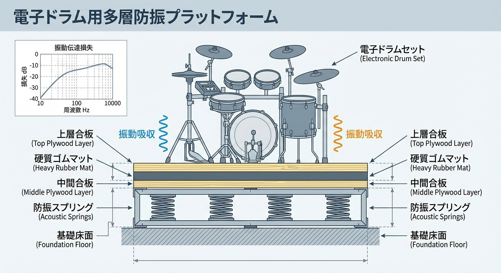

"I want to play acoustic drums at home!"

This is the ultimate dream for any drummer, but in reality, drums are the <strong>"hardest instruments to soundproof."</strong> Unlike pianos or guitars, drums produce explosive noise exceeding 100dB and massive low-frequency vibrations that travel right through the floor.

The cold hard truth: <strong>To play acoustic drums in a standard Japanese apartment, you need a minimum of $40,000 in professional construction.</strong> However, by utilizing hybrid solutions and electronic kits, you can build a viable practice environment. This guide outlines the physical limits of drum soundproofing and the best strategies for 2026.

## 1. Why Drums are the "Final Boss" of Soundproofing

Soundproofing drums is difficult due to two simple physical phenomena:

- <strong>Overwhelming Airborne Sound:</strong> A snare hit or cymbal crash reaches <strong>100–110dB, equivalent to standing under a passing train or at a construction site.</strong>
- <strong>Impact-Borne Vibration:</strong> The kick drum strike directly shakes the <strong>"building's skeleton (floor and beams)," transmitting sound to neighbors in an instant.</strong>

Simply sticking foam sponges on the wall won't block even 1% of a drum's output.

## 2. Requirements for Acoustic Drums: The "Dr-60" Standard

If you are committed to playing real drums at home, these are your non-negotiables:

| Item                | Requirement                | Reason                                            |
| :------------------ | :------------------------- | :------------------------------------------------ |
| <strong>Performance</strong> | <strong>STC 60+ (Dr-60)</strong> | Reduces 100dB down to a quiet whisper             |
| <strong>Floor Structure</strong> | <strong>Floating Floor</strong> | Isolates the kick drum's impact from the building |
| <strong>Room Size</strong> | <strong>Min. 50 sq ft (3 mats)</strong> | For kit placement and natural resonance           |
| <strong>Avg. Budget</strong> | <strong>$40,000 – $70,000</strong> | For building a "heavy box inside a box"           |

Standard prefab booths (STC 35-40) like the Yamaha Avitecs are <strong>not enough for acoustic drums.</strong> You need custom site-built construction where the floors, walls, and ceiling are physically decoupled from the original structure.

## 3. The Realistic Choice: E-Drums + Professional Vibration Control

For 99% of drummers, the most strategic choice is a <strong>"High-End Electronic Drum Kit."</strong>

### Benefits of E-Drums

- <strong>Zero Airborne Leak:</strong> Since you use headphones, there is almost no sound vibrating the air.
- <strong>Space Saving:</strong> Fits into a 20–30 sq ft space.
- <strong>Lower Cost:</strong> Get a pro-tier flagship model for $2,000–$5,000.

### Solving the "Silent" Drummer's Main Issue: Pedal Vibration

Even if the pads are quiet, the "thump" of the pedals vibrates the floor.

- <strong>Solution:</strong> Create a <strong>vibration platform using high-density rubber mats (at least 20mm thick) and "vibration isolators." This makes late-night practice a reality even in apartments.</strong>

## 4. The Hybrid Approach: Professional Performance Strategy

Unless you have a massive budget for a basement studio, we recommend this hybrid setup:

1.  <strong>At Home</strong>: E-Drums + Heavy Floor Damping (for daily technical practice)
2.  <strong>Off-Site</strong>: Rental Studio (for real drum feel and full-band practice)

This hybrid life is the most efficient, neighbor-friendly, and cost-effective way to live as a drummer in 2026.

## 5. Conclusion: Don't Let Noise Stop Your Passion

Drums are the most environment-dependent instruments. The biggest risk is getting into a neighbor dispute and losing your drive to play altogether.

Be realistic about your soundproofing needs and invest wisely. Finding a way to drum without holding back—even once or twice a week—is the greatest joy for any serious player.

---

_※ Note: Drum room construction adds significant weight. Always consult with a structural engineer to ensure your floor can handle the load._

