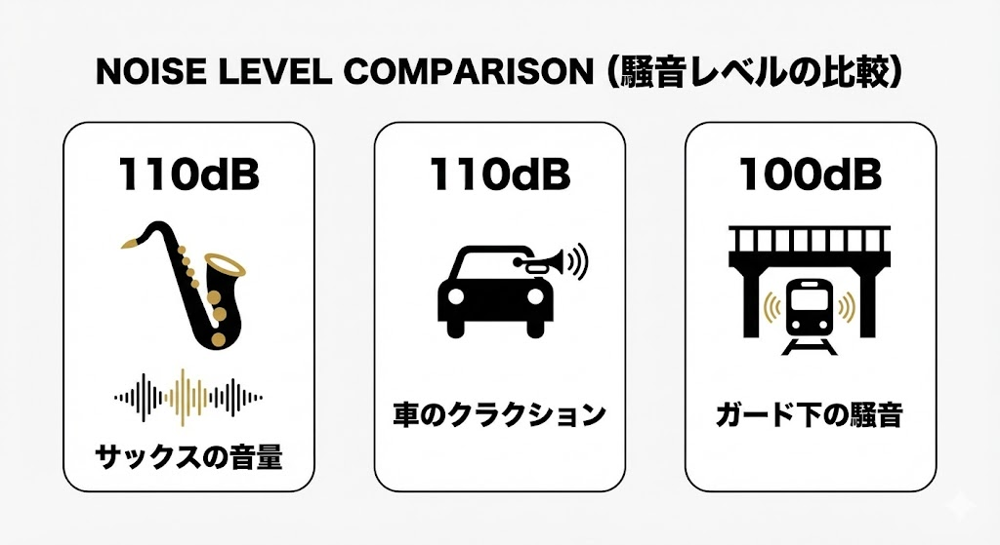

---
title: "Saxophone Practice in Apartments: e-Sax, Booths, or Yamaha? 3 Realistic Solutions for Noise"
description: "Want to practice saxophone in your Japanese apartment but afraid of chaos and police? We clarify the cruel reality of sound volume (110dB!) and propose 3 realistic solutions: e-Sax mutes, modified budget booths, and professional soundproof rooms like Yamaha Avitecs."
slug: "saxophone-practice-apartment"
date: "2026-01-06T02:50:00+09:00"
lastmod: "2026-02-28"
draft: false
lang: "en"
category: "use-case"
subcategory: "musician-pro"
tags: ["Saxophone","Soundproofing","Apartment","Living","e-Sax","Soundproof","Soundproof Room"]
image: ./cover.jpg
---
"I live in an apartment, but I want to play the saxophone to my heart's content."
"How wonderful it would be to practice at home after work."

Many people share this dream but are held back by the fear: "What if the neighbors complain about the noise?" or "What if the police are called?"
As a result, many end up hauling their heavy instruments to karaoke boxes on weekends.

First, I must tell you a <strong>Cruel Reality</strong>.

The saxophone (especially Alto and Tenor) produces one of the loudest volumes among acoustic instruments, reaching <strong>100dB to 110dB</strong>.
This is equivalent to listening to <strong>"a train passing under a guard"</strong> or <strong>"a car horn"</strong> at close range.

Unfortunately, <strong>it is 100% impossible to play raw saxophone in a standard Japanese wooden apartment or condo without any soundproofing.</strong>
Even if you close the windows, if the walls are thin, it will immediately become noise pollution at a level where you get reported.

However, you don't have to give up.

There are modern tools and technologies designed specifically for "playing saxophone at home."
In this article, we propose three realistic solutions tailored to your <strong>"Budget and Commitment Level"</strong>.

---

## 3 Options: Comparison Chart

First, let's grasp the characteristics of each option roughly.

| Option | Method | Budget | Silence | Ease | Recommended For |
| :--- | :--- | :--- | :--- | :--- | :--- |
| <strong>Lv.1</strong> | <strong>e-Sax (Silencer)</strong> | ¥50k - ¥60k | Fair (-25dB) | Excellent | Start cheaply & now |
| <strong>Lv.2</strong> | <strong>Budget Booth + Mods</strong> | ¥150k - ¥200k | Good (-30dB) | Fair | DIY Lovers / Crafty |
| <strong>Lv.3</strong> | <strong>Unit Soundproof Room</strong> | ¥500k - ¥1M | Excellent (-40dB~) | Good | <strong>Serious Players</strong> |

---

## Option 1: [Budget: ¥50,000] Use a Silencer "e-Sax" (Beginner)

For those who want the "cheapest, easiest, and immediate" solution, a <strong>box-type mute</strong> that covers the entire instrument is the best choice.

### BEST BRASS "e-Sax"
Available for Alto and Tenor, this is the most famous saxophone silencer.
It looks like a large throat lozenge case where you insert your instrument and hands to play.

-   <strong>Price</strong>: Around ¥50,000 - ¥60,000 (New)
-   <strong>Weight</strong>: Approx. 2.3kg (Quite heavy with the instrument)
-   <strong>Performance</strong>: Approx -25dB reduction

### Pros: Easy to start and Cost-effective
The biggest advantage is <strong>ease of introduction</strong>.
Even if you don't have space for a soundproof room, you can store it in a closet.

It also features an internal microphone, allowing you to hear yourself with reverb through headphones, which helps maintain motivation.

### Cons: Heavy and not for "Midnight"
A -25dB reduction brings <strong>saxophone explosion</strong> down to <strong>"normal conversation (TV volume)"</strong> levels.

This is fine during the day; neighbors will only hear something faint like "someone watching TV."

However, <strong>using it late at night is risky.</strong>
Japanese apartment walls can be thin enough to transmit even conversation, so playing at night might still be audible as a weird "muffled sound" and cause anxiety.

Also, supporting the weight of the instrument + case with just your neck strap puts a significant strain on your body during long practice sessions.
Still, it is undoubtedly the only option that fulfills the dream of "playing in an apartment" for ¥50,000.

---

## Option 2: [Budget: ¥150,000 - ¥200,000] Are Budget Soundproof Booths Worth It? (Intermediate)

Cheap assembly soundproof rooms like "Danbotchi" and "OTODASU" are popular. But do they work for saxophones?

### Conclusion: Not enough on their own
To be honest, <strong>the intense sound pressure of a saxophone can easily penetrate standard cardboard or plastic cardboard booths.</strong>

High frequencies might be cut, but the rich mid-low tones of a sax will leak through to the next room.
Especially in the initial state of "Danbotchi," it is no exaggeration to say the saxophone sound is <strong>almost transparent</strong>.

### Must be "Modified"
If you want to realize a soundproof room with a budget of ¥100,000s, the following combination becomes almost mandatory.

1.  Buy a <strong>Danbotchi</strong> (approx. ¥100,000).
2.  Cover the entire surface with multiple layers of <strong>Lead Sheets (Sound Insulation Sheets)</strong>.
3.  Line the interior tightly with <strong>Absorption Materials</strong>.

Only after this DIY modification will you get performance comparable to or slightly better than the "e-Sax".
Do not expect to just "buy and play."
Also, in summer, it becomes a <strong>Hellish Sauna</strong>, so be prepared for sweaty practice sessions.

---

## Option 3: [Budget: ¥500,000+] Professional Soundproof Room (Professional)

"I want to practice saxophone as a lifelong hobby." "I want an environment where I can play 24 hours a day."
If you wish this strongly, investing in a <strong>professional unit soundproof room</strong> from the start is often cheaper and more satisfying in the long run than repeating half-baked investments.

### YAMAHA Avitecs / KAWAI Nasaal
Rooms made by instrument manufacturers are in a different league.

-   <strong>Performance</strong>: Dr-35 to Dr-40 (Certified for Piano/Sax)
-   <strong>Size</strong>: 0.8 to 1.5 tatami mats
-   <strong>Price</strong>: ¥600,000 - ¥1,000,000 (New), ¥300,000 - ¥500,000 (Used)

### Why is this the strongest?

1.  <strong>"Inaudible" Peace of Mind</strong>
    With Dr-35, the sound in the next room drops to a huge "mosquito buzz" level. If the TV is on, they won't hear a thing.
2.  <strong>Comfort</strong>
    Most models support air conditioning installation, so you can practice coolly even in summer (e-Sax and budget booths are saunas).
3.  <strong>Asset Value</strong>
    Yamaha and Kawai rooms are in high demand and can be sold for a high price as used items when you move. Considering "Purchase Price - Resale Price," the actual expense is surprisingly reasonable.

---

## Summary: Which one is for you?

Have you decided on your strategy?

-   <strong>Cheapest, Daytime only</strong> → <strong>Silencer (e-Sax)</strong>
-   <strong>Medium budget, DIY spirit</strong> → <strong>Budget Booth + Modification</strong>
-   <strong>Midnight practice, Lifetime hobby</strong> → <strong>YAMAHA/KAWAI Soundproof Room</strong>

The saxophone is an incredibly expressive and fun instrument once you have the "environment where you can make sound."

Before you get into trouble with half-baked measures and start hating your instrument, please choose the <strong>"Correct Soundproofing"</strong> that suits your situation.
If you are lost, I strongly recommend visiting a music store and actually stepping inside a soundproof room to experience it.

