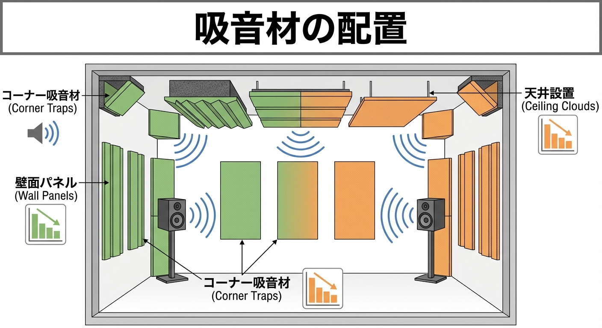

\"I bought a Dr-35 soundproof room, so now I can play all night!\"

If you've ever practiced late at night with that thought, only to have your family or neighbors complain the next day that it was \"noisy,\" have you ever had such a spine-chilling experience?

I'll tell you the conclusion right away.

<strong>The explosive sound of a trumpet will not be stopped by just any ordinary soundproof room.</strong>

However, it's too early to give up.
By not relying solely on the Dr-values in the catalog and instead devising "interior sound absorption" and "placement," you can dramatically increase the perceived soundproofing performance.

Today, I'll teach you the ultimate soundproof room customization techniques to subdue an roar exceeding 110dB.

## A Trumpet's "110dB" Is Comparable to a Jet Engine. Why Late-Night Practice Is Impossible with Dr-35

### The Brutal Reality in Numbers

First, let's know our enemy (the sound of the trumpet).
The sound pressure level of a trumpet is usually <strong>100dB</strong>, and it can even reach <strong>128dB</strong> when a pro plays ff (fortissimo). This is close to the level of a jet engine noise or the sound of a thunderclap.

Let's do some simple subtraction here.

> <strong>110dB (Instrument Sound) - 35dB (Dr-35 Room) = 75dB (Sound Leaking Outside)</strong>

75dB is roughly the volume of a vacuum cleaner or a noisy street.

During the day, it might be forgiven as it blends in with daily life sounds.
However, the quietness of a Japanese residential area late at night (after 10 PM) is around <strong>30 to 40dB</strong>. If you run a vacuum cleaner at full blast in that silence, a complaint will surely come.

### If You Play Late at Night, Dr-40 to 45 Is Necessary

If you want to practice late at night without hesitation, you need to drop the sound leaking outside to at least the 40dB range.
In other words, a performance of <strong>Dr-40 (S-Class) or higher</strong>, ideally <strong>Dr-45</strong>, is a mandatory line for a soundproof room.

## What to Do When Dr-40 Is Still Not Enough: "The Ultimate Soundproof Room Customization"

"I already bought a Dr-35 room..."
"I have Dr-40, but I'm still anxious."

For you, I recommend <strong>"doping" through sound absorption.</strong>

### The Magic of Absorption: "Killing" Sound Before It Hits the Wall

Soundproofing consists of two things: "insulation/blocking (stopping it with a wall)" and "absorption (erasing it with a sponge)."
If you play a trumpet inside a cramped soundproof room, the sound energy continues to reflect between walls and becomes amplified (a state of sound saturation).

So, you paste a lot of <strong>sound-absorbing material</strong> in the room.
Before the sound hits the wall, the sponge consumes the sound energy by turning it into heat energy. This can weaken the force itself that tries to pierce through the wall.

### The Secrets of Placement: Never Aim Your Bell

1.  <strong>Look Away from Weak Points</strong>
    The weak points of a soundproof room are the "door" and the "ventilation fan." Aiming your bell towards these is like shooting a cannon at the enemy's main castle. <strong>Make sure to face the bell towards the "thick wall side" or "the side without windows."</strong>

2.  <strong>Distance Is Justice</strong>
    If the distance between the bell and the wall is close, the sound pressure will hit the wall directly without decaying. If possible, choose a room of <strong>1.2 mats or larger</strong>, ideally 1.5 mats, and stand away from the wall. A few tens of centimeters makes a huge difference in soundproofing performance.

## How to Create "Resonance" that Won't Tire Your Lips. Tips for Not Making It Too Dead

"Focusing on soundproofing, I pasted sound-absorbing material all over, and it's uncomfortable because there's no resonance at all."
This is also a common failure.

In a room that is too "dead" (no resonance), it's hard to hear your own sound, so you unconsciously play with forced power.
This will quickly tire your lips and lead to bad habits.

### Recommended: Leave Some "Live" Points

- <strong>Front of the Bell:</strong> Dare to leave it without sound-absorbing material and place a hard board or similar to reflect the sound.
- <strong>Side and Back:</strong> Paste plenty of sound-absorbing material here.

By doing this, you can secure the "return of your own sound (monitor)" while cutting out only the useless residual resonance energy that spreads throughout the room.
This is the resonance of a professional studio where you won't get tired even after playing for a long time.

## Summary: Win Your Practice Using Every Trick

Soundproofing for a trumpet doesn't end with buying a soundproof room. That's just the start.

1.  <strong>Performance</strong>: Aim for Dr-40 or higher if practicing late at night.
2.  <strong>Absorption</strong>: Attenuate energy inside the room to prevent leakage outside.
3.  <strong>Placement</strong>: Don't aim your bell at the door or ventilation fan.

Don't over-rely on catalog values, and by using these tricks, get your late-night ff (fortissimo). No one can stop your passion anymore.

## Related Articles

- <strong>[Choosing Materials]: [What is the Difference Between Sound-Absorbing and Sound-Insulating Materials?](absorption-vs-insulation)</strong>
- <strong>[Choosing Rooms]: [Size and How to Choose a Unit Soundproof Room](soundproof-room-size)</strong>

