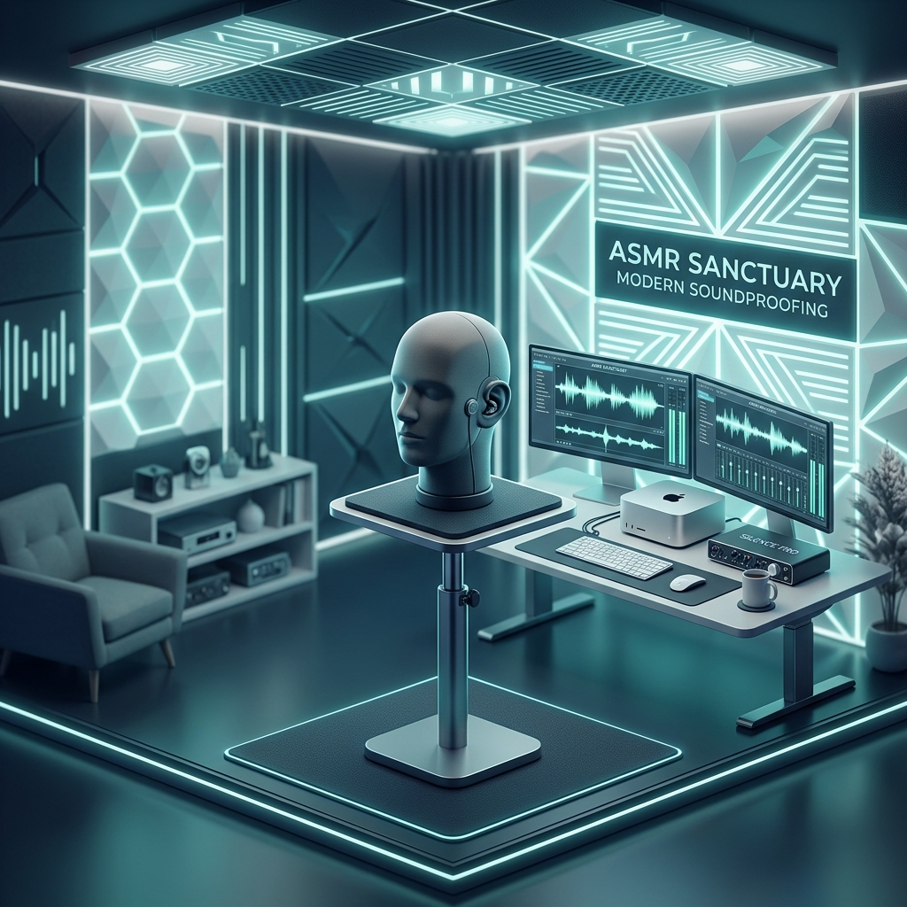

<RegionBanner />

「マイクの感度を上げると、エアコンの音が『サーッ』と入ってしまう」
「吐息のような繊細な音だけを残し、生活音を完全に消し去りたい」
「視聴者に『まるで隣にいるよう』な没入感を届けたい」

ASMRアーティストにとって、防音環境は単なる設備ではなく、<strong>「楽器の一部」</strong>です。2026年現在、ロスレスオーディオや高解像度イヤホンの普及により、配信環境の「ノイズフロア（無音時の雑音レベル）」の低さが、クリエイターの評価を分ける決定的な要素となっています。

本記事では、視聴者の脳を心地よい刺激（Tingles）で包み込むための、2026年版「静寂の聖域」の作り方を解説します。

## 1. なぜASMRには「静寂」という高価な機材が必要なのか

ASMRは、日常では聞き逃すような「極めて小さな音」を主役にします。

- <strong>驚異的なS/N比の要求:</strong> 主役の音が小さいため、相対的に背景ノイズが目立ちます。背景に微細な「サーッ」という音があるだけで、没入感は40%以上損なわれるというデータもあります。
- <strong>視聴者の耳の進化:</strong> 2026年の視聴者は、AIノイズキャンセリングを搭載した高級機で聴いています。これらは配信側の「環境ノイズ」をも容赦なく描き出し、不快感を与えてしまいます。

## 2. 目標数値：ノイズフロア「15dB以下」の衝撃

一般的な放送スタジオ（25〜30dB）を遥かに凌ぐ静寂が、トップクラスのASMRには求められます。

### ① 徹底した「脱・ファン」戦略
録音室内にPCを持ち込むのは2026年では禁忌です。
- <strong>ファンレスデバイスの活用:</strong> M4チップ以降のiPad Proや、完全ファンレスの静音ワークステーションを別室に配置し、Thunderbolt経由で操作するのが標準です。

### ② 微振動（ソリッドボーン・ノイズ）の遮断
床からの微妙な振動を消すため、吸振性能を高めた「メタマテリアル・インシュレーター」をマイクスタンドの足元に配置しましょう。

## 3. 「聖域」を支える3つの音響テクノロジー

### 空調：静寂を保ちながら「酸素」を守る
「録音中だけエアコンを切る」のは集中力を削ぎます。
- <strong>超静音換気（ロスナイ最新モデル）:</strong> 5dB以下の動作音で回る熱交換型換気システムを選定。
- <strong>サイレント・ダクト:</strong> 風切り音を消すためのハニカム構造サイレンサーは、ASMR配信者の必須装備です。

### 吸音と拡散：デッドすぎない「透明感」
単に吸音材を貼るだけでは、音が「詰まった」不自然な響きになります。
- <strong>最新メラミンフォーム:</strong> 2026年主流の難燃性・高密度吸音材を使用。
- <strong>ディフューザー（拡散板）:</strong> バイノーラルマイクの「背後」に拡散パネルを置くことで、音の広がり（立体感）を自然に演出します。

### クリーン電源と32bit float
電気的ノイズ（ホワイトノイズ）を極限まで排除します。
- <strong>特化型インターフェース:</strong> 内部ノイズの極めて低い2026年モデルを使用し、32bit float録音でダイナミックレンジを確保します。

## 4. プロが教える「ASMR環境」のセルフ診断

導入・改善後に以下の3点をチェックしてください。

1.  <strong>「自分のまばたきの音が聞こえるか？」</strong>: マイクを通して、衣擦れや瞬きがはっきりと聞こえるなら、ノイズフロアは合格点です。
2.  <strong>「3時間滞在しても集中力が切れないか？」</strong>: 換気が不十分だとCO2濃度が上がり、声の「艶」が失われます。
3.  <strong>「[身バレ防止の遮音性能](/use-case/streamer-tech/vtuber-proofroom-knowledge)」は十分か？</strong>: 外を通る救急車のサイレンなどがマイクに入らないDr-40以上の性能が理想です。

## まとめ：静寂という「土台」を整える

高価なマイクを揃える前に、まずは「静寂という土台」を整えてください。整えられた静寂の中で録った音は、どんなAI処理よりも美しく、視聴者の心に深く響きます。

あなたが作り出す静寂が、多くの人に癒やしを届けることを願っています。

---
<strong>関連記事</strong>:
- <strong>[【実戦】配信者のための防音室設置・テクニカルガイド](/use-case/streamer-tech/streamer-proofroom-setting)</strong>
- <strong>[防音室のローンとリセールバリュー：実質コストの考え方](/ja/use-case/streamer-tech/streamer-soundproof-loan-resale/)</strong>
- <strong>[【2026最新】防音リフォーム補助金活用マニュアル](/knowledge/soundproof-subsidy-system-list)</strong>
