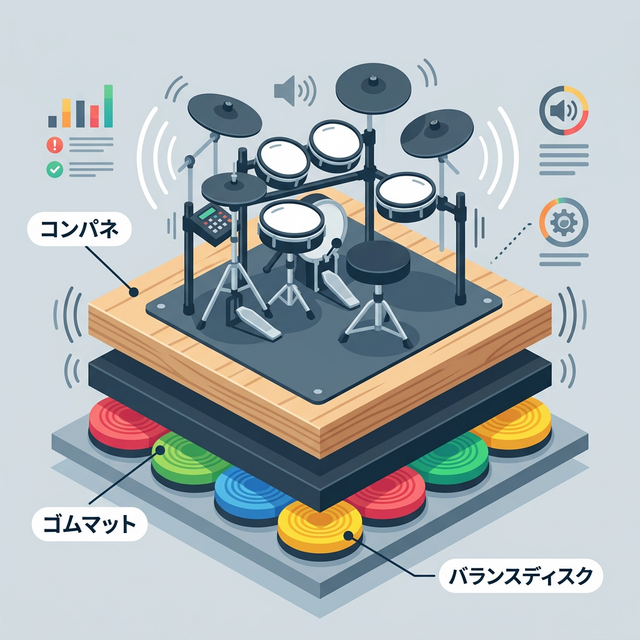

<RegionBanner />

「電子ドラムなら、ヘッドホンをすれば無音だからマンションでも大丈夫」

もし楽器店の店員さんにこう言われたとしたら、それは <strong>半分嘘</strong> です。
確かに「叩く打撃音」は静かです。しかし、電子ドラムにはもっと恐ろしい騒音源があります。

それは、あなたがペダルを踏むたびに発生する <strong>「振動（固体音）」</strong> です。
この振動対策をせずにマンションで叩けば、数日で階下から苦情が来るでしょう。今回は、電子ドラマーの救世主であるDIY防振術 <strong>「ディスクふにゃふにゃシステム」</strong> について解説します。

## 電子ドラムの苦情No.1は「キックペダル」。打撃音より怖い固体音

### ドスン！という衝撃は消えない

バスドラム（キック）を踏む動作を想像してください。
足の裏で力一杯ペダルを踏み込み、ビーターがパッドを叩く。この時、体重と運動エネルギーがすべて床への「衝撃」に変わります。

これは、床の上でジャンプしたり、ハンマーで床を叩いているのと同じです。
この振動はコンクリートを伝って階下の天井を揺らし、「ドスン、ドスン」という不気味な低周波騒音となって響き渡ります。

### 市販の「防振マット」だけでは不十分

楽器店で売られている厚さ1cm程度のドラムマット。
これは「床の傷防止」や「滑り止め」には有効ですが、数百キロ相当の衝撃荷重を受け止める防振性能はありません。

振動を止めるには、 <strong>床を物理的に浮かせる（Floating Floor）</strong> しかないのです。

## 古の知恵「タイヤふにゃふにゃシステム」とは？

かつて、ドラマーたちの間で伝説となったDIY手法があります。
通称「タイヤふにゃふにゃシステム」です。

- <strong>構造 :</strong> 古タイヤのチューブを何個も並べ、その上にコンパネ（合板）を乗せ、ドラムを置く。
- <strong>原理 :</strong> 空気の力で完全に床から浮いているため、振動絶縁性が極めて高い。
- <strong>欠点 :</strong> チューブの空気圧管理が大変、ゴム臭い、製作難易度が高い。

効果は絶大でしたが、手間がかかりすぎるのが難点でした。そこで登場したのが、現代版の進化系です。

## 現代の主流「ディスクふにゃふにゃシステム」とその作り方

タイヤの代わりに、フィットネス用の <strong>「バランスディスク」</strong> を使う方法です。
これならAmazonなどで手軽に入手でき、空気管理も楽で、臭いもしません。

### 必要な材料（ホームセンターで揃います）

1.  <strong>バランスディスク</strong> : 4〜6個（ドラムセットの広さに応じて）
2.  <strong>コンパネ（合板）</strong> : 厚さ12mm以上を2枚（重ねて使うと強度UP）
3.  <strong>風呂マット</strong> : ジョイントマットでも可。ディスクと板の間に挟んで安定させる。

### 作り方（3ステップ）

1.  <strong>設置</strong> : バランスディスクを四隅と中央に配置します。
2.  <strong>積層</strong> : その上に風呂マットを敷き、さらにコンパネを乗せます。これで「浮いたステージ」が完成です。
3.  <strong>設置</strong> : ステージの上に電子ドラムを組み立てます。

### 驚異の効果

このステージの上でドラムを叩くと、ステージ全体が「ぐらぐら」「ふわふわ」と揺れます。
この <strong>「揺れ」こそが、振動エネルギーを吸収している証拠</strong> です。

床に伝わるはずだった衝撃を、バランスディスクの空気が受け止め、熱に変えて逃してくれます。これにより、階下への振動伝達率は劇的に（数十dBレベルで）低下します。

## まとめ：ドラムの静音はDIYで勝ち取れ！

マンションで電子ドラムを叩く権利は、お金で買うものではなく、知恵とDIYで勝ち取るものです。

- <strong>キックペダル :</strong> 最大の敵。マット1枚では防げない。
- <strong>浮き床 :</strong> 床から物理的に絶縁するしかない。
- <strong>ディスクふにゃふにゃ :</strong> コスパ最強の現代的解決策。

「苦情が来てから対策する」のではなく、「対策してから叩き始める」。
これが集合住宅で音楽を楽しむための最低限のマナーです。今週末、ホームセンターへ行きましょう。

