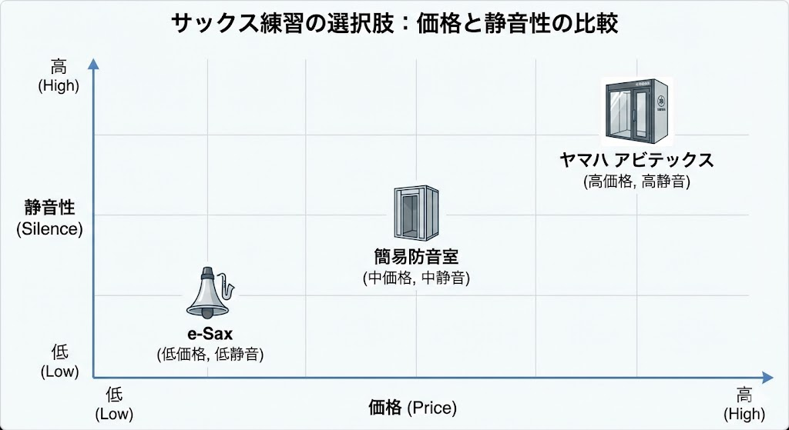

---
title: "サックスの防音対策｜アパートで練習するための3つの現実的な選択肢【2026年版】"
description: "アパートでサックスを吹きたいけれど苦情が怖い人へ。e-Sax（消音器）や本格防音室に加え、2026年最新のデジタルサックス事情まで。予算と本気度別に、あなたにぴったりの練習環境の作り方をアドバイザーが優しく解説します。"
slug: "saxophone-practice-apartment"
date: "2026-01-06T02:50:00+09:00"
lastmod: "2026-03-08T23:50:00+09:00"
draft: false
lang: "ja"
category: "use-case"
subcategory: "musician-pro"
tags: ["サックス","アパート","e-Sax","デジタルサックス","防音室"]
image: ./cover.jpg
---
<RegionBanner />

「アパートに住んでいるけれど、サックスを思いっきり吹きたい」
「仕事から帰ってきて、自宅で練習できたらどんなに楽しいだろう」

そう思っても、「音漏れで近所から苦情が来るのが怖い」「警察を呼ばれたらどうしよう」という不安が先に立ち、結局休日にカラオケボックスへ重い楽器を運んでいる人は多いのではないでしょうか。

まず、 <strong>残酷な現実</strong> をお伝えしなければなりません。

サックス（特にアルトサックスやテナーサックス）は、生楽器の中でもトップクラスの音量が出ます。その大きさは <strong>100dB〜110dB</strong> 。
これは <strong>「電車が通過する時のガード下」</strong> や <strong>「自動車のクラクション」</strong> を至近距離で聞くのと同じレベルです。

残念ながら、 <strong>普通の木造アパートやマンションで、何の対策もせずに生音で吹くことは100%不可能です。</strong>
窓を閉めても壁が薄ければ、即座に通報されるレベルの騒音公害になってしまいます。

しかし、諦める必要はありません。

現代には「自宅でサックスを吹く」ための技術とツールがあります。
この記事では、あなたの <strong>「予算と本気度」</strong> に合わせて、3つの現実的な選択肢（レベル別）を提案します。

## 3つの選択肢：比較チャート

まずは、それぞれの選択肢の特徴をざっくりと把握しましょう。

| 選択肢   | 対策名               | 予算        | 消音効果   | 手軽さ | 向いている人         |
| :------- | :------------------- | :---------- | :--------- | :----- | :------------------- |
| <strong>Lv.1</strong> | <strong>e-Sax（消音機）</strong>  | 5〜6万円    | △ (-25dB)  | ◎      | とにかく安く始めたい |
| <strong>Lv.2</strong> | <strong>簡易防音室＋改造</strong> | 15〜20万円  | ◯ (-30dB)  | △      | DIY好き・工作が得意  |
| <strong>Lv.3</strong> | <strong>ユニット防音室</strong>   | 50〜100万円 | ◎ (-40dB~) | ◯      | <strong>本気で上達したい</strong> |

---

## 選択肢1：【予算5万円】消音器「e-Sax」を使う（初級編）

「一番安く、手軽に、今すぐ吹きたい」という人に最適なのが、楽器ごと覆うタイプの <strong>消音器（はこ型ミュート）</strong> です。

### ベストブラス「e-Sax（イーサックス）」

アルトサックス用の消音器として最も有名なのがこれです。
のどあめのような形状のケースの中に楽器と両手を突っ込んで演奏します。

- <strong>価格</strong>: 5〜6万円程度（新品実勢価格）
- <strong>重量</strong>: 約2.3kg（楽器を含めると結構重い）
- <strong>消音性能</strong>: -25dB程度

### メリット：手軽さとコスパ

最大のメリットは <strong>導入のしやすさ</strong> です。
部屋に防音室を置くスペースがなくても、クローゼットにしまっておけます。

また、内部にマイクがあり、ヘッドホンから自分の音をエフェクト（リバーブ）付きで聴けるため、練習のモチベーションも維持しやすいです。

### デメリット：重さと「深夜は無理」な性能

-25dBという数値は、 <strong>サックスの爆音を普通の話し声（テレビの音）レベルまで下げる</strong> 効果があります。

これなら、昼間であれば隣の部屋には「何かテレビ見てるな」程度にしか聞こえません。

しかし、 <strong>深夜の使用は厳しい</strong> です。
アパートの壁は話し声程度でも通してしまうことがあるため、夜中に使うと「モゴモゴした音」が響いて不気味に思われるリスクがあります。

また、楽器＋ケースの重量を首（ストラップ）だけで支えることになるため、長時間の練習は身体への負担が大きいです。
それでも「アパートで吹く」という夢を5万円で叶えてくれる唯一の選択肢であることは間違いありません。

---

## 選択肢2：【予算15〜20万円】簡易防音室は使えるか？（中級編）

「だんぼっち」や「OTODASU」といった、安価な組立て式防音室が人気です。サックスには使えるのでしょうか？

### 結論：そのままでは力不足

正直に申し上げますと、 <strong>サックスの強烈な音圧には、段ボールやプラスチック段ボール単体の防音室では太刀打ちできません。</strong>

高音域はある程度カットできますが、サックス特有の豊かな中低音は壁を突き抜けて隣室に届いてしまいます。
特に「だんぼっち」の初期状態では、サックスの音は <strong>筒抜け</strong> と言っても過言ではありません。

### 使うなら「改造」前提で

予算10万円台で防音室を実現したい場合、以下の組み合わせがおおよそ必須になります。

1.  <strong>だんぼっち（約10万円）</strong> を購入する。
2.  <strong>鉛シート（遮音材）</strong> を全面に何重にも貼る。
3.  <strong>吸音材</strong> を内部にギチギチに貼る。

ここまでDIYで改造して、ようやく「e-Sax」と同等か、少し上の性能が得られます。
「買っただけで防音できる」とは思わない方が安全です。
また、夏場は <strong>地獄のような暑さ</strong> になるため、長時間の練習には覚悟が必要です。

---

## 選択肢3：【予算50万円〜】本格防音室を入れる（上級・本気編）

「一生の趣味としてサックスを続けたい」「24時間いつでも吹ける環境が欲しい」
そう強く願うなら、中途半端な投資を繰り返すより、最初から <strong>本格的なユニット防音室</strong> を入れるのが、結果的に一番安上がりで満足度が高いです。

### YAMAHA アビテックス / カワイ ナサール

楽器メーカーが作る防音室は、性能が段違いです。

- <strong>遮音性能</strong>: Dr-35〜Dr-40（ピアノやサックス公認レベル）
- <strong>サイズ</strong>: 0.8畳〜1.5畳
- <strong>価格</strong>: 新品で60〜100万円、中古で30〜50万円

### なぜこれが最強なのか？

1.  <strong>「聞こえない」安心感</strong>
    Dr-35あれば、隣の部屋では「蚊の鳴くような音」レベルまで下がります。テレビをつけていれば全く聞こえません。
2.  <strong>快適性</strong>
    エアコンを取り付けられるモデルが多く、夏でも涼しく練習できます（e-Saxや簡易防音室は夏場がサウナ地獄です）。
3.  <strong>資産価値</strong>
    ヤマハやカワイの防音室は需要が高く、引っ越しの際に中古として高く売れます。実質的な出費は「購入額 - 売却額」で考えると、意外と安く済みます。

---

## 2026年の注目：デジタルサックスという選択肢

「防音室を置く場所もないし、e-Saxの重さも辛い…」という方へ、2026年現在非常に有力な選択肢となっているのが <strong>デジタルサックス（YAMAHA YDS-150など）</strong> です。

これは「サックスの形をした電子楽器」ですが、本物のサックスと同じ指使いで演奏でき、息の強弱で音色をコントロールできます。

- <strong>最大のメリット</strong>: <strong>ヘッドホンが使えること。</strong> 生音はほとんど出ないため、深夜のアパートでも全く問題ありません。
- <strong>活用法</strong>: 自宅ではデジタルで指使いとフレーズを練習し、休日にスタジオで生楽器を思いきり吹く。この「ハイブリッド練習」が、現代のアパート住まいにおける最も賢い上達術と言えるでしょう。

---

## まとめ：あなたにおすすめの対策は？

あなたにおすすめの対策は決まりましたか？

- とにかく安く、昼間だけでいい → <strong>消音器 (e-Sax)</strong>
- 少し予算はあるし、DIYも厭わない → <strong>簡易防音室＋改造</strong>
- 深夜も吹きたい、一生モノの環境が欲しい → <strong>YAMAHA/KAWAI 防音室</strong>

サックスは「音が出せる環境」さえあれば、これほど感情豊かで楽しい楽器はありません。

中途半端な対策でトラブルになって楽器が嫌いになってしまう前に、自分の環境に合った <strong>「正しい防音」</strong> を選んでくださいね。
もし迷ったら、楽器店で実際に防音室に入ってみることを強くおすすめします。

