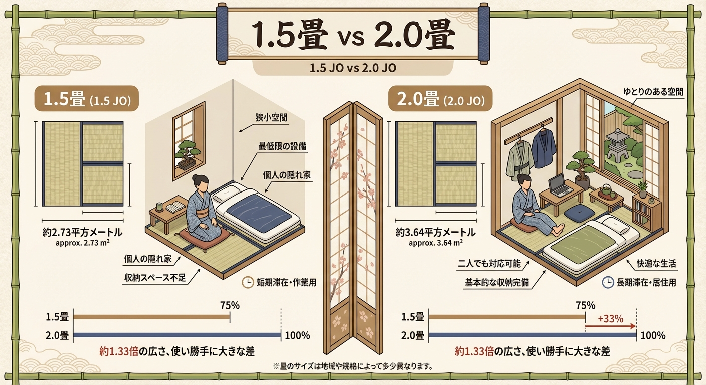

<RegionBanner />

「ガッ！」

気持ちよく吹いていたその瞬間、プラスチックのような鈍い音と共に手に伝わる衝撃。
恐る恐るスライドを見ると、先端が少し歪んでいる…。

トロンボーン奏者にとって、 <strong>「スライドを壁にぶつける」</strong> ことほど恐ろしい事故はありません。修理費は数万円、ひどければスライド全交換。何より、「またぶつけるかも」という恐怖心で、練習に身が入らなくなってしまいます。

そうならないために、防音室選びで最も重要なのは「畳数」ではなく、 <strong>「スライドが伸びる有効長」</strong> です。今回は、事故ゼロの環境を作るためのサイズ選びを解説します。

## トロンボーン奏者に1.2畳をおすすめしない理由

### 必要な長さは「2メートル」

トロンボーンという楽器は、他の管楽器と決定的に違う点があります。 <strong>「楽器の長さが可変する」</strong> ことです。

身長にもよりますが、楽器を構えてスライドを第7ポジション（一番遠く）まで伸ばした時、背中からスライドの先端までは <strong>約2メートル</strong> 近いスペースが必要になります。

### 1.2畳では「直立不動」できない

一般的な1.2畳タイプの防音室の内寸は、長辺でも約1.7メートル程度です。
つまり、 <strong>正面を向いて真っ直ぐ吹くことは物理的に不可能</strong> です。常に体を斜めにしたり、スライドを縮こまらせて吹くことになります。

これでは、正しい姿勢もブレスコントロールも身につきません。トロンボーンにおいて「1.2畳」は、あくまで「倉庫」か「緊急避難所」であり、練習場としては不適格です。

## 「1.5畳 vs 2.0畳」対決。予算別・配置の正解

では、どのサイズを選べばよいのでしょうか？

### 1.5畳の正解は「対角線配置」

予算やスペースの都合で、どうしても1.5畳しか置けない場合。
正解は <strong>「対角線を使う」</strong> ことです。

1.5畳の長方形の部屋（内寸 約1.2m × 1.7m）でも、対角線の長さなら <strong>2メートル以上</strong> を確保できます。

- <strong>メリット :</strong> スライドを思い切り伸ばせる唯一のポジション。
- <strong>デメリット :</strong> 部屋の角に向かって吹くことになるため、譜面台を置く位置が限定される。視覚的に圧迫感がある。

「事故リスク」は減らせますが、快適とまでは言えません。これが1.5畳の限界です。

### 2.0畳なら「正面」で戦える

もし設置スペースが許すなら、迷わず <strong>2.0畳</strong> を選んでください。

2.0畳あれば、内寸で長辺が1.7〜1.8メートル以上確保できるモデルが多く、さらに対角線を使わずとも余裕を持って構えられます。

- <strong>メリット :</strong> 譜面台を正面に置き、自由に体を揺らして演奏できる。椅子を入れるスペースもある。
- <strong>安心感 :</strong> 「絶対にぶつからない」という安心感が、演奏のダイナミクスを広げます。

## 音の抜けを確保する「ベルの向き」と吸音

配置が決まったら、次は音の響きです。

トロンボーンのベルは長く、前方へ鋭く音を飛ばします。壁が近いと、跳ね返った音（反射音）が直接顔に戻ってきます。

<strong>対策：ベルの先に「厚めの吸音パネル」</strong>

対角線配置の場合、部屋の「角（コーナー）」に向かって吹くことになります。コーナーは音が溜まりやすく（低音が篭りやすい）、反射もキツくなりがちです。

ベルが向いているコーナー部分には、<strong>厚手の吸音材（ロックウールボードや吸音ウレタン）</strong> を設置しましょう。これにより、壁からの強烈な「跳ね返り」をマイルドにし、広いホールで吹いているような「音の抜け」を擬似的に作ることができます。

## まとめ：トロンボーン防音室選びのポイント

トロンボーンの防音室選びは、楽器の修理費と天秤にかけるべき投資です。

- <strong>1.2畳 :</strong> 絶対にやめましょう。スライドを壊します。
- <strong>1.5畳 :</strong> 対角線配置ならなんとかなるが、窮屈さは覚悟して。
- <strong>2.0畳 :</strong> 推奨。ストレスフリーで練習に没頭できる。

「修理代3万円」を何度も払うリスクを考えれば、最初に数十万円追加してでも広い部屋を買う価値は十分にあります。
あなたのスライドと上達を守るために、広さには妥協しないでください。

