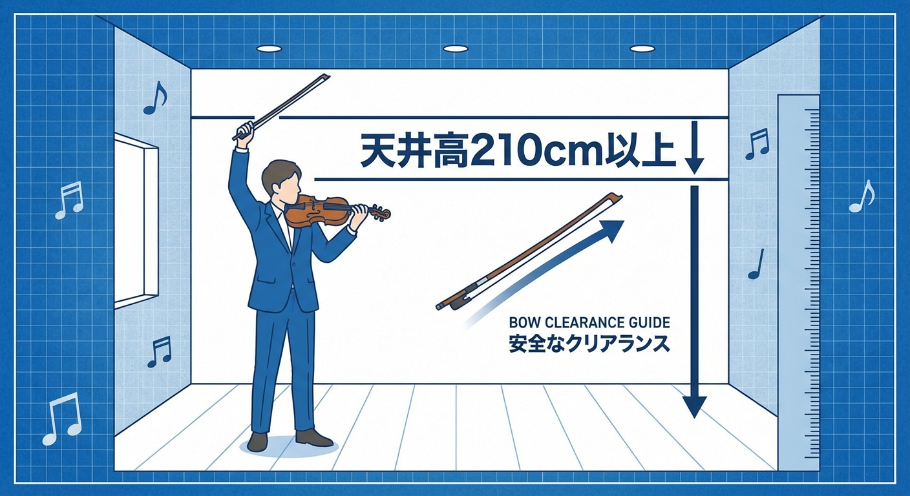

<RegionBanner />

防音室のカタログを眺めているあなた、真っ先に目が行くのは「広さ（畳数）」や「遮音性能（Dr値）」ではありませんか？

もちろんそれらも重要ですが、バイオリン奏者が <strong>何よりも優先すべきスペック</strong> があります。

それは <strong>「天井の高さ」</strong> です。

ここを軽視すると、数百万クラスの弓が一瞬で折れる大事故につながります。
今回は、大切な相棒を守るための「Highタイプ（高壁）」防音室の選び方を解説します。

## バイオリンの悲劇。標準高さの防音室で起きた「弓の破損」

### アップボウの瞬間に「ガッ！」

バイオリンは立奏（立って演奏すること）が基本です。
情熱的に演奏し、フィナーレで勢いよく右手を振り上げるアップボウ（上げ弓）。その瞬間、弓先が天井の照明や突起物に激突する——。

これは決して笑い話ではありません。防音室を買ったばかりの奏者が、慣れない狭さで距離感を誤り、数十万円〜数百万円の弓を破損させる事故は後を絶ちません。

### 必要な高さは「身長＋腕＋弓」

日本の一般的なユニット防音室の標準室内高は、 <strong>約195cm〜200cm</strong> 前後です。
しかし、身長170cmの人が腕を伸ばし、さらに74cmの弓を持てば、最高点は優に <strong>210cm</strong> を超えます。

つまり、標準タイプの防音室では、普通に弾くだけで常に「天井激突」のリスクと隣り合わせなのです。

## メーカー別「Highタイプ」防音室の選び方

このリスクを回避するために、各メーカーは天井を高くしたモデルを用意しています。

### YAMAHAとカワイの選択肢

- <strong>YAMAHA アビテックス :</strong>
  「セフィーネNS」などのシリーズには <strong>「高壁（Highタイプ）」</strong> というオプションがあります。これにより、室内高を <strong>220cm</strong> 程度まで上げることができます。

- <strong>カワイ ナサール :</strong>
  標準モデルでも比較的高めの設定ですが、カスタムタイプではさらに余裕を持たせることが可能です。

### 見積もり時の合言葉は「Highタイプで」

防音室を注文する際は、必ず <strong>「バイオリンを立って弾くので、天井が高いモデル（Highタイプ）で見積もりをお願いします」</strong> と伝えてください。
多少コストは上がりますが、弓の修理費や「買い直し」に比べれば安い保険です。

## 広さよりも「高さ」と「横幅」。1.2畳でも快適に弾くコツ

予算には限りがあります。もし何かを削るなら「奥行き」です。

### 優先順位の黄金律

バイオリン奏者の防音室選びの優先順位は以下の通りです。

1.  <strong>天井高</strong>（最重要：弓を守る）
2.  <strong>横幅</strong>（重要：右手のボーイングスペース）
3.  <strong>奥行き</strong>（妥協可能：譜面台との距離）

例えば、正方形の1.5畳よりも、 <strong>長方形の1.2畳（Highタイプ）</strong> の方が、バイオリンには適している場合があります。
横幅さえ確保できれば、奥行きが多少狭くても演奏に支障はありません。

### 湿度管理も忘れずに

最後に、バイオリンは木製楽器です。
防音室内部は気密性が高く、エアコンを使えば乾燥し、梅雨時は湿気がこもります。
大切な楽器を守るため、<strong>加湿器・除湿機</strong> の設置スペースも考慮に入れてください。

## まとめ：バイオリン防音室選びのポイント

バイオリン防音室は、「音を止める箱」である前に、「安全に演奏できる箱」でなければなりません。

- <strong>標準タイプ :</strong> 危険。選ばないでください。
- <strong>Highタイプ :</strong> 必須。天井高210cm以上を確保あひましょう。
- <strong>選び方 :</strong> 広さ（畳数）よりも高さと横幅を優先。

弓を折ってからでは遅すぎます。最初の見積もり段階で、プロに「高さ」へのこだわりをぶつけてください。
それがあなたの音楽生活を守る第一歩です。

