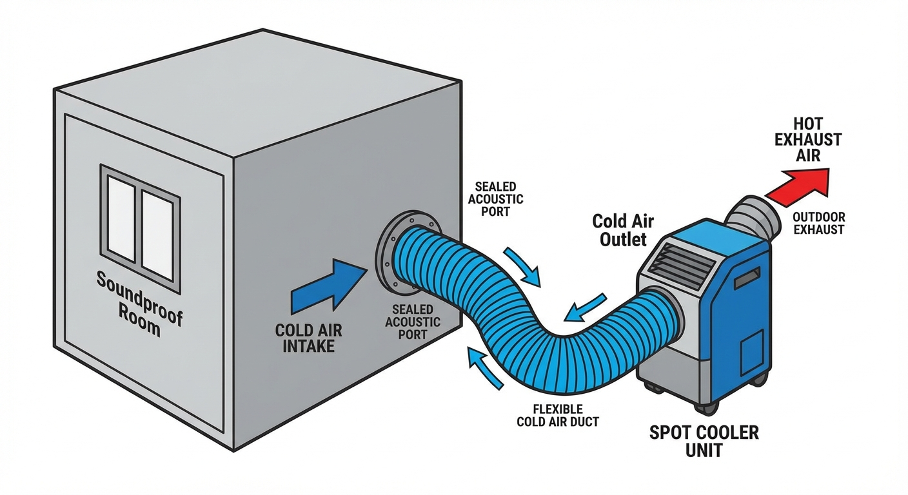

"I want to focus on my playing, but it's so hot inside the soundproof room that I'm dripping with sweat. The fan is roaring, and noise is getting picked up by my microphone..."

For streamers who play long game commentaries or live streams, a soundproof booth in summer is pure hell. If you are using a "simple soundproof room (about 1 to 1.5 tatami mats)" where you cannot install a wall-mounted air conditioner, your only savior is a <strong>"spot cooler (portable air conditioner)."</strong>

However, simply bringing a spot cooler into the soundproof room and turning on the power will lead you to see the hell of <strong>the room getting even hotter.</strong>
In this article, we explain the guidelines for "correctly" installing a spot cooler without compromising your streaming quality or the room's soundproofing performance.

## 1. Why Will You Fail if You "Just Leave It There"?

A spot cooler pushes "cold air" out the front, but at the same time, it blasts a massive amount of <strong>"hot air (exhaust heat)"</strong> out the back.
If you run this in an enclosed space like a soundproof room, the volume of exhaust heat will overpower the volume of cold air, and as a result, the room temperature will continue to rise.

Furthermore, because a spot cooler has a powerful compressor built inside its body, <strong>its "operating noise (a low hum)" is extremely loud,</strong> and your streaming microphone will undoubtedly pick up the noise if left as is.

## 2. The Ultimate Right Answer: Keep the Cooler Body "Outside" and Only Bring the Cold Air "Inside"

The only method to simultaneously solve the operating noise and exhaust heat problems is the style of <strong>"placing the spot cooler body outside the soundproof room and pulling only the cold air inside via a duct."</strong>

### What You Need

1.  <strong>Spot Cooler Main Unit</strong>: Choose a type from brands like Iris Ohyama or Nakatomi, where a duct (hose) can be attached to the cold air outlet.
2.  <strong>Flexible Duct (Aluminum, etc.)</strong>: A hose for transporting the cold air.
3.  <strong>Insulation Material (Duct Cover)</strong>: Wrap the duct with fiberglass wool or a dedicated thermal tube to prevent condensation from forming on the surface of the duct carrying the cold air.

### Installation Steps

1.  <strong>Placement of the Main Unit</strong>: Install the spot cooler outside the soundproof room (preferably in a cool room where an air conditioner is running).
2.  <strong>Pulling in the Cold Air Duct</strong>: Connect the duct to the "cold air outlet" of the spot cooler and pull it into the room through the soundproof room's "air intake port (or ventilation fan hole, etc.)."
3.  <strong>Sealing the Gaps</strong>: To prevent sound from leaking through the gaps around the hole where the duct passes, securely fill the gaps with a clay-like putty (AC putty).

_Figure: The ideal setup with the spot cooler outside and only cold air ducted inside_

## 3. Tricks to Keep Wind Noise Out of the Microphone

If the cold air blows directly onto your face or microphone, an intense wind noise (pop noise) sounding like "bobo-bo..." will ride on your audio.

- <strong>Airflow Direction Control:</strong> Adjust the direction of the duct so the air hits the wall before circulating, or build and attach your own louvers (airflow direction adjustment plates) at the tip of the pulled-in duct.
- <strong>Processing via Plugins:</strong> If minute compressor noises resonate through the duct, use a "noise suppression filter (such as NVIDIA Broadcast)" in OBS Studio or your streaming software to cut out only the environmental noise.

## 4. Precaution: Controlling the "Air Pressure" Inside the Soundproof Room

When you push a massive amount of outside air into a soundproof room with a spot cooler, the air pressure inside the soundproof room rises (positive pressure), making the door difficult to open or causing unexpected sound leaks from gaps.

The cardinal principle of ventilation is <strong>"to exhaust the exact same amount of air from elsewhere as the amount you brought in."</strong>
Always make sure to run the "ventilation fan (exhaust)" originally attached to the soundproof room to secure an exit for the air.

## Conclusion: A Comfortable Streaming Environment Starts with "Heat Isolation"

- <strong>Placing a spot cooler "inside the soundproof room" is absolutely unacceptable.</strong>
- <strong>Leave the main unit "outside" and pull "only the cold air" inside with a duct.</strong>
- <strong>Fill the gaps with putty and run the exhaust ventilation fan to maintain the air pressure balance.</strong>

Once you perfect this setup, even without a wall-mounted air conditioner, you'll comfortably handle long raid battles or scream-inducing horror game streams right in the middle of late summer. Execute "heat isolation" now and maintain your peak streaming performance.

